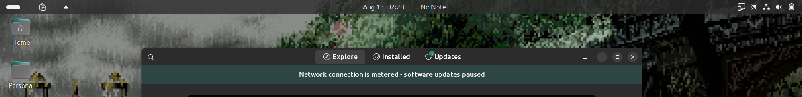
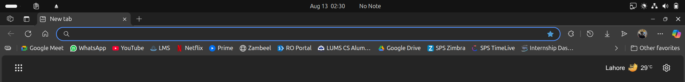
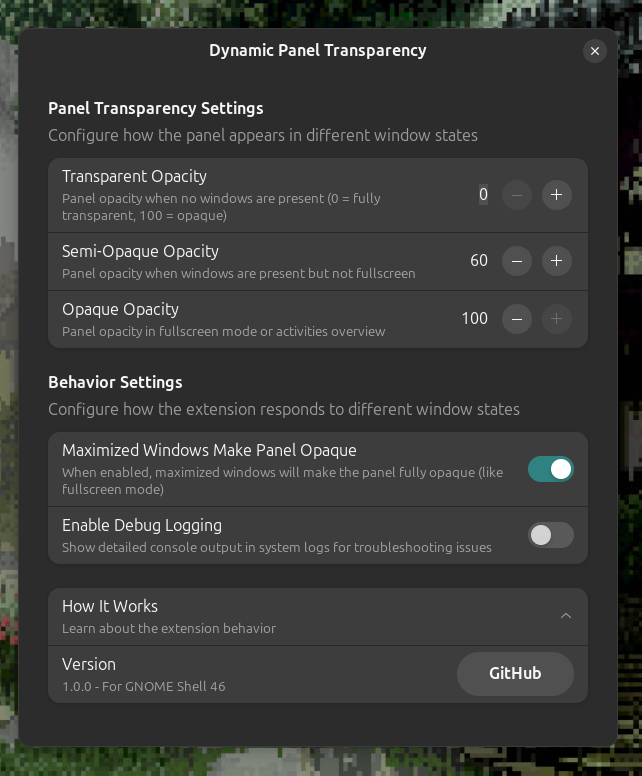

# Dynamic Panel Transparency

> A smart GNOME Shell extension that automatically adjusts the top panel's transparency based on your window activity


## ✨ Features

**Dynamic Panel Transparency** creates an immersive desktop experience by intelligently managing your top panel's visibility:

- 🎯 **Smart Detection** - Automatically detects window states and adjusts accordingly
- 🎨 **Three Transparency States** - Transparent, semi-opaque, and fully opaque modes
- ⚙️ **Highly Configurable** - Customize opacity levels and animation speeds
- 🚀 **Performance Optimized** - Efficient window monitoring with minimal system impact
- 🔧 **Debug Support** - Built-in troubleshooting tools

## 📸 Screenshots

| Transparent (No Windows) | Semi-Opaque (Windows Present) | Opaque (Full Screen)          | Settings Panel |
|--------------------------|-------------------------------|-------------------------------|----------------|
|  |  |  |  |

## 🎛️ How It Works

The extension intelligently switches between three states:

| State | Trigger | Default Opacity | Description |
|-------|---------|-----------------|-------------|
| **Transparent** | No windows open | 0% | Clean, distraction-free desktop |
| **Semi-Opaque** | Windows present | 85% | Balanced visibility and aesthetics |
| **Opaque** | Fullscreen/Overview | 100% | Full visibility when needed |

## 🚀 Installation

### From GNOME Extensions Website
1. Visit [extensions.gnome.org](https://extensions.gnome.org)
2. Search for "Dynamic Panel Transparency"
3. Toggle the switch to install
4. Configure via Extensions app or settings

### Manual Installation
```bash
# Download and install
git clone https://github.com/vmelonn/dynamic-panel-transparency.git
cd dynamic-panel-transparency

# Install using make
make install

# Or copy manually
mkdir -p ~/.local/share/gnome-shell/extensions/
cp -r . ~/.local/share/gnome-shell/extensions/dynamic-panel@vmelonn.github.io/

# Enable the extension
gnome-extensions enable dynamic-panel@vmelonn.github.io
```

## ⚙️ Configuration

Access settings through:
- **GNOME Extensions app** → Dynamic Panel Transparency → ⚙️ Settings
- **Command line**: `gnome-extensions prefs dynamic-panel@vmelonn.github.io`

### 🎨 Panel Transparency Settings

- **Transparent Opacity** (0-100%) - How transparent when no windows are open
- **Semi-Opaque Opacity** (0-100%) - Transparency level with windows present  
- **Opaque Opacity** (0-100%) - Opacity in fullscreen or overview mode
- **Animation Duration** (0-1000ms) - Speed of transparency transitions

### 🎯 Behavior Settings

- **Maximized Windows Make Panel Opaque** - Treat maximized windows like fullscreen
- **Debug Logging** - Enable detailed console output for troubleshooting

## 🔧 Troubleshooting

### Common Issues

**Extension not working after GNOME update:**
```bash
gnome-extensions disable dynamic-panel@vmelonn.github.io
gnome-extensions enable dynamic-panel@vmelonn.github.io
```

**Panel stuck in one state:**
1. Enable debug logging in settings
2. Check logs: `journalctl -f -o cat /usr/bin/gnome-shell`
3. Look for window detection messages
4. Try toggling the "Maximized Windows" setting

**Conflicts with other extensions:**
- Temporarily disable other panel-modifying extensions
- Check if themes override panel styling

### Debug Mode

Enable debug logging to see detailed information:
```bash
# Enable debug logging in extension settings, then:
journalctl -f -o cat /usr/bin/gnome-shell | grep "Dynamic Panel"
```

## 🏗️ Development

### Building from Source
```bash
git clone https://github.com/vmelonn/dynamic-panel-transparency.git
cd dynamic-panel-transparency

# Compile schemas
make compile-schemas

# Create distribution package  
make package

# Install for testing
make install
```

### Project Structure
```
dynamic-panel-transparency/
├── extension.js          # Main extension logic
├── prefs.js             # Settings UI
├── metadata.json        # Extension metadata
├── schemas/             # Settings schema files
├── screenshots/         # Documentation images
├── LICENSE              # GPL-3.0-or-later license
└── Makefile            # Build automation
```

## 🤝 Contributing

Contributions are welcome! Here's how you can help:

1. **🐛 Report Bugs** - Use the GitHub Issues tab
2. **💡 Suggest Features** - Open a feature request
3. **🔧 Submit Code** - Fork, create feature branch, submit PR
4. **📖 Improve Docs** - Help make the README better
5. **🌍 Translate** - Help localize the extension

### Development Setup
```bash
# Fork the repo and clone your fork
git clone https://github.com/yourusername/dynamic-panel-transparency.git
cd dynamic-panel-transparency

# Create a feature branch
git checkout -b feature/amazing-new-feature

# Make your changes and test
make install

# Commit and push
git commit -m "Add amazing new feature"
git push origin feature/amazing-new-feature

# Create a Pull Request on GitHub
```

## 🆘 Support

- 📖 **Documentation**: Check this README and inline comments
- 🐛 **Bug Reports**: [GitHub Issues](https://github.com/vmelonn/dynamic-panel-transparency/issues)
- 💬 **Discussions**: [GitHub Discussions](https://github.com/vmelonn/dynamic-panel-transparency/discussions)
- 📧 **Direct Contact**: rayan.atif2@gmail.com

## 📋 Compatibility

- **GNOME Shell**: 46+
- **Tested On**: 
  - Ubuntu 24.04 LTS (GNOME 46)

## 🗺️ Roadmap

### Planned Features
- [ ] Multi-monitor support
- [ ] Per-application transparency rules
- [ ] Custom panel colors (beyond just opacity)
- [ ] Theme integration
- [ ] Keyboard shortcuts
- [ ] More animation easing options

### Considering
- [ ] Wayland-specific optimizations
- [ ] Integration with other panel extensions
- [ ] Export/import settings

## 📜 License

GPL-3.0-or-later License - see [LICENSE](LICENSE) file for details.

This extension is free software: you can redistribute it and/or modify it under the terms of the GNU General Public License as published by the Free Software Foundation, either version 3 of the License, or (at your option) any later version.

## 🙏 Acknowledgments

- GNOME Shell development team for the excellent extension API
- Community contributors and testers
- Users who provide feedback and bug reports

## 📊 Stats


---

<p align="center">
  <strong>Made with ❤️ for the GNOME community</strong><br>
  <sub>If this extension improved your desktop experience, consider giving it a ⭐!</sub>
</p>
